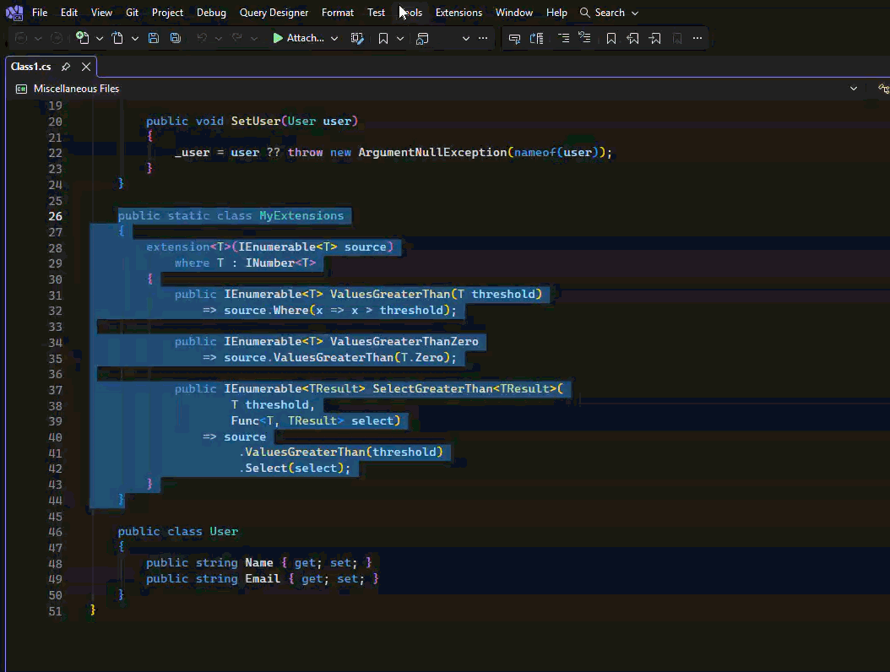
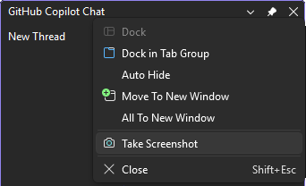

[marketplace]: <https://marketplace.visualstudio.com/items?itemName=madskristensen.CodeShot>
[vsixgallery]: <https://www.vsixgallery.com/extension/CodeShot.06cf14ac-c16c-4c61-9e83-2edd8692648c>
[repo]: <https://github.com/madskristensen/CodeShot>

# CodeShot for Visual Studio

[][vsixgallery]

[Install CodeShot from the Visual Studio Marketplace][marketplace] or get the latest CI build from [Open VSIX Gallery][vsixgallery].

----

**Create polished, annotated code screenshots without leaving Visual Studio.** CodeShot preserves your editor's syntax colors, gives you tools to call out or redact details, and copies a share-ready PNG in seconds.

*Turn a selection into a presentation-ready image while staying in your editor.*

## Why CodeShot

| Need                      | What CodeShot provides                                                                |
| ------------------------- | ------------------------------------------------------------------------------------- |
| Share readable code       | VS syntax colors, configurable fonts, line numbers and high-resolution export         |
| Explain an implementation | Rectangles, arrows, expression highlights, line emphasis and text callouts            |
| Protect sensitive details | Opaque redactions baked into the exported image                                       |
| Capture more than code    | Screenshots of visible Visual Studio tool windows and open menus                      |
| Fit your destination      | Theme, solid, gradient or transparent backgrounds with configurable spacing and scale |
| Keep code searchable      | Optional plain text alongside the clipboard image when no redaction is present        |

Use CodeShot for documentation, pull requests, release notes, bug reports, presentations and social posts without re-creating your editor appearance in a separate design tool.

## Getting started

1. Select code in the editor.
2. Choose **Tools > Take Screenshot** or press **Ctrl+Shift+M**.
3. Adjust the preview, then press **Ctrl+C** to copy or **Ctrl+S** to save.

Opening CodeShot copies the initial screenshot automatically. A progress indicator remains visible while a screenshot is being prepared. Later selection changes update the preview without replacing the clipboard.

## Annotate and redact before sharing

Use the **Annotate** menu to point at an expression, add a note, highlight an identifier or cover sensitive content. In Select mode, drag an annotation to move it or drag its handles to resize it. Clicking a line without selecting an annotation emphasizes it and dims the surrounding code. **Ctrl+Z** and **Ctrl+Y** undo and redo each annotation change.

Redactions are baked into the exported PNG. When one is present, CodeShot also omits the unredacted plain-text clipboard format.

*Explain the important parts and cover sensitive values before the image leaves Visual Studio.*

## Capture Visual Studio tool windows

Right-click a visible tool window's title bar and choose **Take Screenshot**. CodeShot copies the screenshot immediately and opens it for cropping, annotation and export. Use **Refresh Preview** to return to the current editor selection.

Tool-window capture uses the pixels currently visible on screen, including Win32 and WebView content. Keep the window unobscured while capturing it. Other tabs in the same docking group are excluded, and pixels outside the rounded frame remain transparent. Cropping and its undo history are available for tool-window captures; text captures use the editor selection as their natural boundary.

<!-- Screenshot instructions: Update art/tool-window-context-menu.png with a tightly cropped, current-theme capture of a recognizable Visual Studio tool window. Keep the title bar and Take Screenshot context-menu command visible, remove unrelated menu items where practical, and avoid repository names or machine-specific content. -->

*Capture Error List, Test Explorer, Solution Explorer and other visible tool windows.*

## Capture Visual Studio menus and dialogs

In the CodeShot tool window toolbar, choose **Capture Foreground UI in 5 Seconds**, then open the top-level menu, context menu, cascading submenu or modal dialog you want while the countdown appears in the tool window. CodeShot captures the topmost Visual Studio surface at the pointer or the foreground modal window, copies the image and opens it for cropping, annotation and export.

Keep the entire surface unobscured during capture. Top-level menus include only the active header and visible cascading submenus. Context menus are trimmed to their visible command surface so background pixels, transparent margins and window shadows are excluded.

<!-- Screenshot instructions: Add art/foreground-ui-capture.png showing the CodeShot toolbar's Capture Foreground UI button alongside a finished capture with one top-level menu and a cascading flyout. Keep the menu text generic, show the crisp trimmed edges clearly, avoid repository or machine-specific details, and use the current dark theme at about 900 pixels wide. -->

## Customize and export

The toolbar controls font, size, line numbers, title bar and indentation. Drag the right edge of a text screenshot to resize it; narrower widths wrap long lines, and double-clicking the edge restores the selection's natural width. 

The status bar shows the exported screenshot dimensions. Use its slider or **Ctrl+mouse wheel** to zoom the preview without changing the exported image. **Tools > Options > CodeShot > General** contains appearance and export settings, all remembered between sessions.

- Follow the editor theme, choose a custom color or gradient, or export with a transparent background.
- Configure window title placeholders, controls, corners, shadow, line height, padding and export scale.
- Optionally copy searchable plain text alongside the image.
- Save directly to a configured folder with a file-name template, or ask where to save each time. Existing files are never overwritten.

## Keyboard shortcuts

| Shortcut             | Action                                        |
| -------------------- | --------------------------------------------- |
| **Ctrl+Shift+M**     | Take a screenshot of the editor selection     |
| **Ctrl+C**           | Copy the current CodeShot image               |
| **Ctrl+S**           | Save the current CodeShot image               |
| **Ctrl+Z**           | Undo the last annotation or crop              |
| **Ctrl+Y**           | Redo the last annotation or crop              |
| **Delete**           | Remove the selected annotation                |
| **Ctrl+D**           | Start the delayed foreground UI capture       |
| **Ctrl+Shift+S**     | Crop a captured Visual Studio surface         |
| **Ctrl+M**           | Select annotations or highlight code lines    |
| **Ctrl+T**           | Add a text callout                            |
| **Ctrl+E**           | Erase an annotation                           |
| **Ctrl+R**           | Draw a rectangle                              |
| **Ctrl+Shift+R**     | Redact sensitive content                      |
| **Ctrl+H**           | Highlight an expression                       |
| **Ctrl+A**           | Draw an arrow                                 |
| **Ctrl+mouse wheel** | Zoom the preview without changing export size |

Shortcuts other than **Ctrl+Shift+M** apply while CodeShot has focus. They can be rebound under the **CodeShot** scope in **Tools > Options > Environment > Keyboard**.

## Privacy

CodeShot processes screenshots locally inside Visual Studio. It does not upload source code or images. Redactions are rendered into the exported PNG, and the plain-text clipboard format is omitted whenever a redaction is present.

## Get involved

Found a bug or have an idea? Open an issue or pull request on the [GitHub repo][repo].

## Credits

CodeShot was inspired by the excellent [CodeSnap](https://marketplace.visualstudio.com/items?itemName=adpyke.codesnap) extension.
