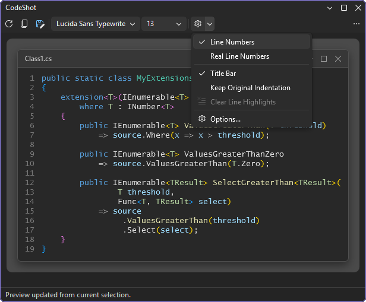
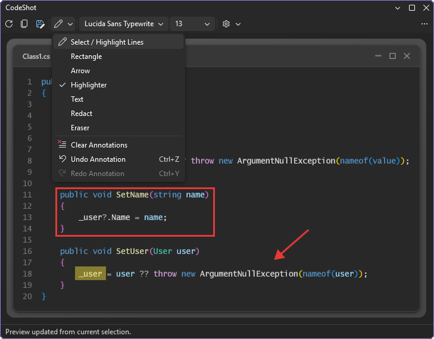
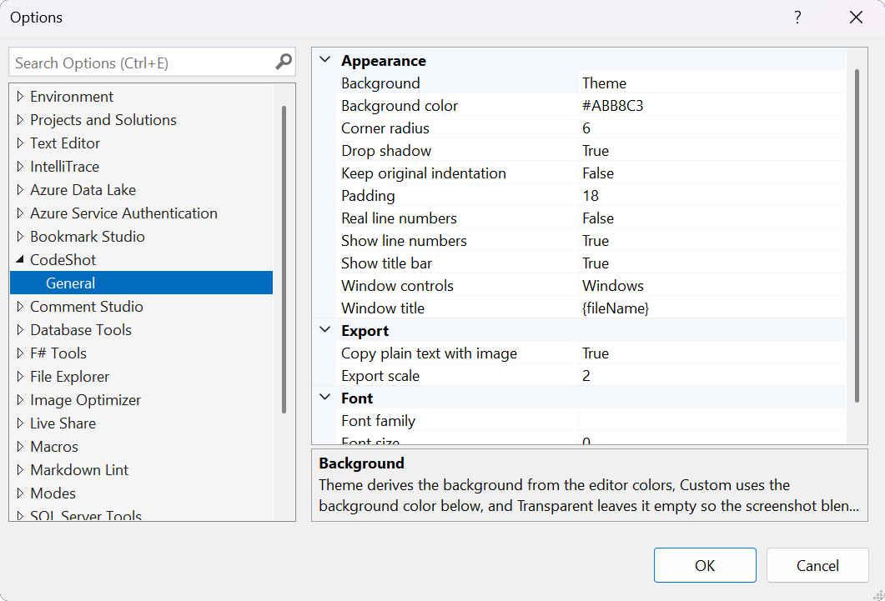

[marketplace]: <https://marketplace.visualstudio.com/items?itemName=madskristensen.CodeShot>
[vsixgallery]: <https://www.vsixgallery.com/extension/CodeShot.06cf14ac-c16c-4c61-9e83-2edd8692648c>
[repo]: <https://github.com/madskristensen/CodeShot>

# CodeShot for Visual Studio

[][vsixgallery]

Download this extension from the [Visual Studio Marketplace][marketplace]
or get the latest CI build from [Open VSIX Gallery][vsixgallery].

------------

Turn an editor selection into a polished, annotated PNG without leaving Visual
Studio.

## Highlights

- Captures the current selection with Visual Studio syntax colors.
- Copies immediately to the clipboard or saves a high-resolution PNG.
- Draws rectangles, arrows, expression highlights and text callouts.
- Redacts sensitive values before the image leaves Visual Studio.
- Customizes fonts, line numbers, title bar, window controls, colors, gradients,
  padding, shadows and export scale.

## Annotate and redact before sharing

Use the **Annotate** menu to point at an expression, add a note, highlight an
identifier or cover sensitive content. Click a line in Select mode to emphasize
it and dim the surrounding code. **Ctrl+Z** and **Ctrl+Y** undo and redo each
annotation change.

Redactions are baked into the exported PNG. When one is present, CodeShot also
omits the unredacted plain-text clipboard format.

## Getting started

1. Select code in the editor.
2. Choose **Tools > CodeShot** or press **Ctrl+Shift+P**.
3. Adjust the preview, then press **Ctrl+C** to copy or **Ctrl+S** to save.

Opening CodeShot copies the initial screenshot automatically. Later selection
changes update the preview without replacing the clipboard.

## Customize and export

The toolbar controls font, size, line numbers, title bar and indentation.
**Tools > Options > CodeShot > General** contains appearance and export settings,
all remembered between sessions.

- Follow the editor theme, choose a custom color or gradient, or export with a
  transparent background.
- Configure window title placeholders, controls, corners, shadow, line height,
  padding and export scale.
- Optionally copy searchable plain text alongside the image.
- Save directly to a configured folder with a file-name template, or ask where
  to save each time. Existing files are never overwritten.

Shortcuts apply only while CodeShot has focus: **Ctrl+C** copies, **Ctrl+S**
saves, **Ctrl+Z** undoes and **Ctrl+Y** redoes. They can be rebound under the
**CodeShot** scope in **Tools > Options > Environment > Keyboard**.

## Credits

CodeShot was inspired by the excellent
[CodeSnap](https://marketplace.visualstudio.com/items?itemName=adpyke.codesnap)
extension.

## Get involved

Found a bug or have an idea? Open an issue or pull request on the
[GitHub repo][repo].